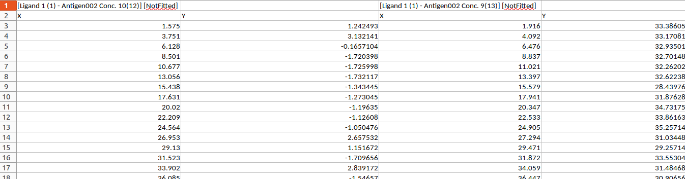

```{r, include = FALSE}
knitr::opts_chunk$set(
  collapse = TRUE,
  comment = "#>"
)
```

This R package consists of a library of functions for processing and analyzing data from SPR binding kinetics experiments, and also contains an example script that executes those functions in a basic pipeline.
 
`htSPRanalysis` can be installed using `devtools::install_git`. If you do not already have `devtools` installed, you can install it using `install.packages(devtools)`. Once devtools is installed, install the package via:

```{r eval=FALSE}
devtools::install_git("https://gitlab.oit.duke.edu/janice/SPRanalysis")

```

Then load the library using:

```{r}
library(SPRanalysis)
```

## Input

The user must provide two input files

1. A time series file that contains the times and corresponding response unit (RU) values for a complete high-throughput SPR run. The software assumes this file is in the output format from the Carterra LSA, with 384 spots on the chip. There are two header lines, as shown below:

{ width=120% }


2. A sample information file in the form of an Excel spreadsheet with the following columns

### Sample information column definitions

* Incl. - Whether or not to include this sample
* Block/Chip/Tray - The block the sample is in. This may be any combination of 1,2,3,4 - separated by commas. Use multiple values for replicates
* Position/Channel/Sensor - The sample well id in the format of a letter (A-H) followed by a number (1-12). The user may enter ranges (for example A1-B12) when there are replicates. The software will automatically generate a row in the sample information data frame for each of the 384 spots on the chip.
* Analyte - the name of the analyte
* Ligand - the name of the ligand
* Baseline - the length of the baseline data collection phase
* Association - the length of the association phase
* Dissociation - the length of the dissociation phase
* Assoc. Skip - the length of time to skip in the beginning of the association phase. Not currently implemented
* Dissoc. Skip - the length of time to skip in the beginning of the dissociation phase. Not currently implemented
* All Concentrations - the concentrations of analyte used. This is a list, separated by commas. It *must* be the same length as the number of time series corresponding to this spot.
* Incl. Concentrations - either a comma separated list of 4 or 5 consecutive concentrations to use for curve fitting *or* the string "All". If "All" is entered, the software will automatically choose 4 or 5 optimal concentrations, as described in the documentation.
* Bulkshift - whether or not to force a fit of bulk shift. Value should be "Y" or "N"
* Regen. - whether or not the surface of the chip is regenerated between cycles
* Bsl Start - start time for using the baseline data to perform baseline correction, if the entire baseline is not to be used
* Base Corr - whether or not to perform baseline correction
* Global Rmax - if set to "Y", the Rmax will be fit globally (one Rmax for all concentrations), otherwise Rmax is fit locally (one per concentration)
* Automate Dissoc. Window - whether or not to automate the length of dissociation phase data used in curve fitting.
* Automate Bulkshift - whether or not to automatically detect bulk shift

### Reading and processing input files, obtaining user supplied options

The function `process_input` when executed in Rstudio will prompt the user for the sample information file and the titration data file. It will also prompt for settings such as the minimum and maximum RU to use for the dissocation window determination, the maximum iterations and the tolerances `ptol` and `ftol`to use for the non-linear least squares curve fit. It returns a `list` object with the sample information, the original time series, the baseline adjusted RUs and several other variables used internally. This is the object that will be passed to the functions for fitting and plotting.

```{r}
processed_input <- process_input()
```

 
### Obtain plots of raw data

```{r}


```


